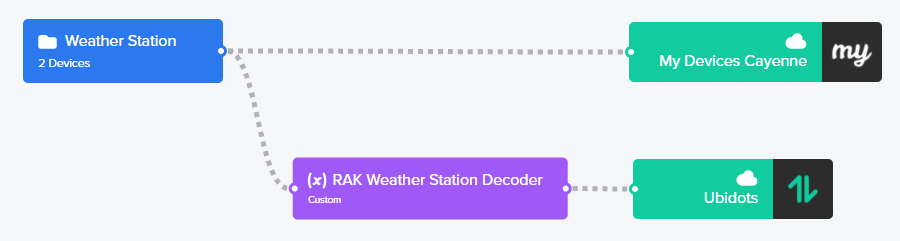
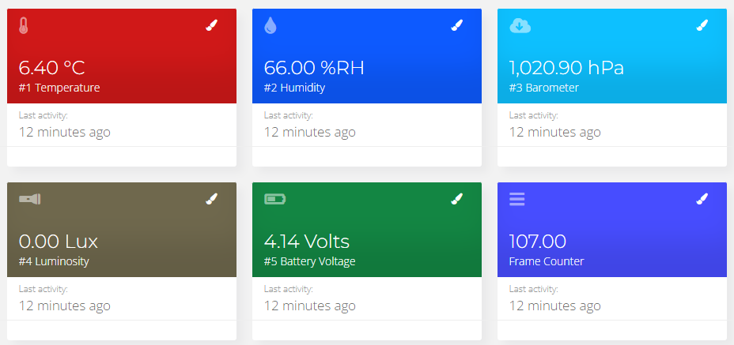
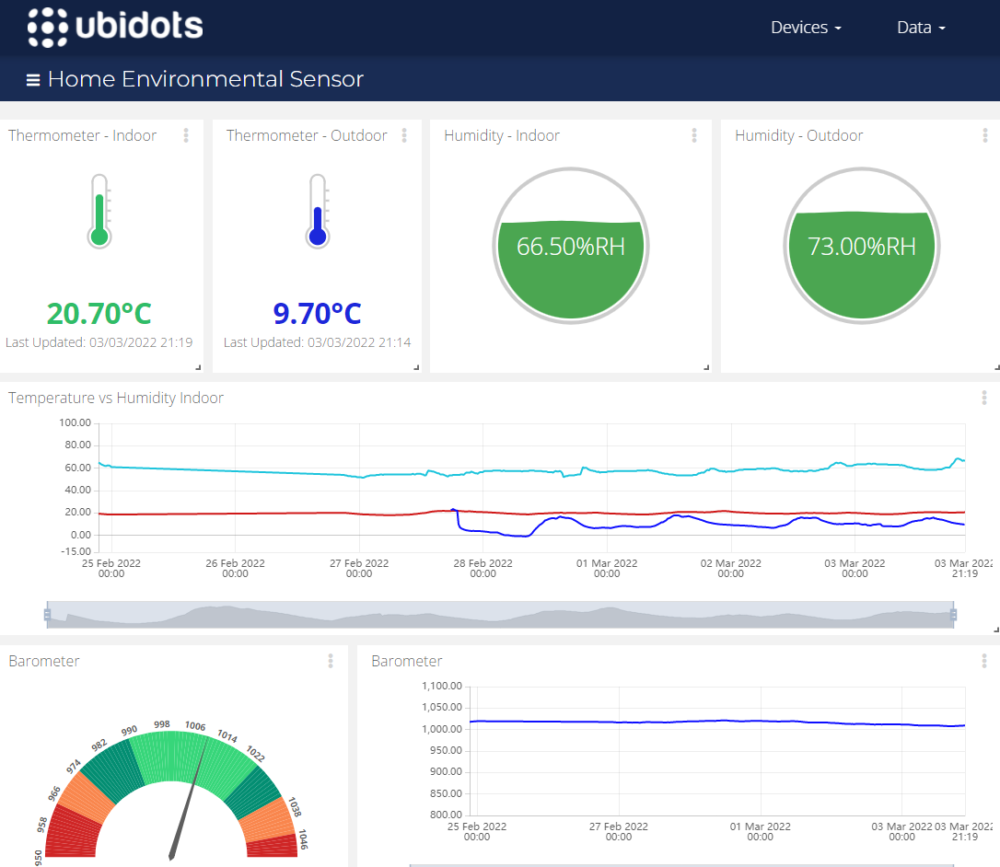
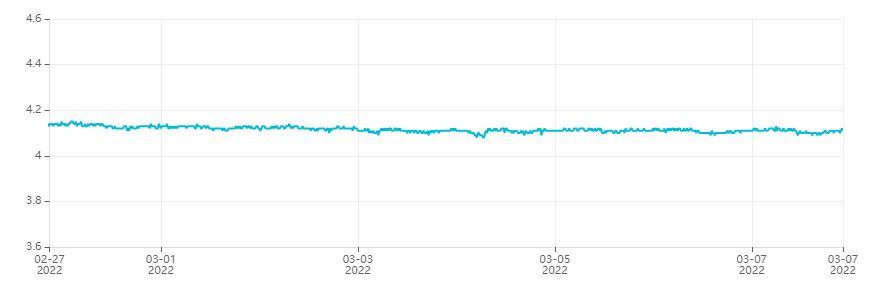

# RAK4631 Weather Monitoring - WisBlock Kit 1

WisBlock Kit 1 Weather Station is a project that uses a RAK4631 LoRa module in order to transmit data (Temperature, Pressure, Luminosity and Humidity) over an Helium Gateway (RAK Miner V2) that relays data to an Helium router that dispatches the data to the platforms MyDevices Cayenne and Ubidots.

- [RAK4631 Weather Monitoring - WisBlock Kit 1](#rak4631-weather-monitoring---wisblock-kit-1)
  - [Architecture](#architecture)
  - [Prerequisites RAK4631](#prerequisites-rak4631)
  - [Cayenne Low Power Payload](#cayenne-low-power-payload)
    - [Temperature](#temperature)
    - [Humidity](#humidity)
    - [Atmospheric Pressure](#atmospheric-pressure)
    - [Luminosity](#luminosity)
    - [Battery Voltage](#battery-voltage)
  - [Helium Flows](#helium-flows)
  - [Helium JavaScript decoder function for Ubidots](#helium-javascript-decoder-function-for-ubidots)
  - [Ubidots](#ubidots)
    - [Ubidots Dashboard](#ubidots-dashboard)
  - [MyDevices Cayenne](#mydevices-cayenne)
  - [Power consumption](#power-consumption)
    - [Power consumption without "deep sleep mode"](#power-consumption-without-deep-sleep-mode)
    - [Power consumption with power saving mode](#power-consumption-with-power-saving-mode)
      - [Main code](#main-code)
    - [Battery Voltage](#battery-voltage-1)
 

## Architecture


## Prerequisites RAK4631

Before going further, I would  suggest you to read the [official RAK4631 Helium documentation](https://docs.helium.com/use-the-network/devices/development/rakwireless/wisblock-4631/). You must follow carrefuly each step to set up your [PlatformIO IDE](https://docs.helium.com/use-the-network/devices/development/rakwireless/wisblock-4631/platformio).

:warning: My firmware was outdated therefore its communication with my USB driver was quite defective. After updating the bootloader, thanks to this [guide](https://forum.rakwireless.com/t/bootloader-fails-to-upgrade-via-ble/4193/3), this issue has been fixed, as well as many others.

The program has been widely inspired by the Wisblock [weather monitoring](https://github.com/RAKWireless/WisBlock/tree/master/examples/RAK4630/solutions/Weather_Monitoring) project from the official GitHub repository RAKWireless.

## Cayenne Low Power Payload

The payload follows the [Cayenne LPP](https://docs.mydevices.com/docs/lorawan/cayenne-lpp) structure. So, the payload has been adapted in order to be compatible with all LoRa nodes which are built on [RAK Unified Interface](https://github.com/RAKWireless/RUI_LoRa_node_payload_decoder).  

Indeed, I already own a [RAK7204](https://store.rakwireless.com/products/rak7204-lpwan-environmental-node) environmental sensor and I want to share the same Helium [flows](https://docs.helium.com/use-the-network/console/flows/) with it and my Wisblock Kit 1 (See section [Helium Flows](#helium-flows)).

The librarie [CayenneLPP.h](https://github.com/ElectronicCats/CayenneLPP) is used in order to build the data payload.

### Temperature

- Data Channel : **02**
- Data Type : **67**

``` C
lpp.addTemperature(2, temp);
```
### Humidity

- Data Channel : **07**
- Data Type : **68**

``` C
lpp.addRelativeHumidity(7, hum);
```

### Atmospheric Pressure

- Data Channel : **06**
- Data Type : **73**

``` C
lpp.addBarometricPressure(6, pres * 10);
```
### Luminosity

Only this data has been added to the **channel 12** with the original RAK7204 payload.      

- Data Channel : **12**
- Data Type : **65**

``` C
lpp.addLuminosity(12, result.lux);
```
### Battery Voltage

- Data Channel : **8**
- Data Type : **02**

``` C
lpp.addAnalogInput(8, vbat / 1000);
```

## Helium Flows

The data received from the device are encoded in Cayenne LPP format and sent as is to MyDevices Cayenne. MyDevices Cayenne expects a structured **buffer** so as to be loaded.

Regarding the Ubidots API, the expected format is JSON. This is performed by the JavaScript function that decodes the LPP buffer to JSON before being sent to Ubidots.



## Helium JavaScript decoder function for Ubidots

As explained earlier, data are transformed into JSON Format before being forwarded to Ubidots.

A common [JavaScript function](https://gist.github.com/vhuynen/4147d0d65edb16d525ade26eb0dfb34a) is shared with my WisNode RAK7204 as well as my WisBlock Kit 1. This same function also decodes data as expected by Ubidots API.

Down below, the result of the JavaScript decoding function expected by the Ubidots API :

``` json
{
  "id": "3ef5a334-2901-498b-9683-6fc902e45542",
  "name": "Ubidots",
  "status": "success",
  "decoded_payload": {
    "barometer": {
      "context": {
        "uplink_fcnt": 156
      },
      "timestamp": 1646124272844,
      "value": 1020
    },
    "battery": {
      "context": {
        "uplink_fcnt": 156
      },
      "timestamp": 1646124272844,
      "value": 4.12
    },
    "humidity": {
      "context": {
        "uplink_fcnt": 156
      },
      "timestamp": 1646124272844,
      "value": 63
    },
    "lux": {
      "context": {
        "uplink_fcnt": 156
      },
      "timestamp": 1646124272844,
      "value": 262
    },
    "temperature": {
      "context": {
        "uplink_fcnt": 156
      },
      "timestamp": 1646124272844,
      "value": 9.6
    }
  }
}
```
## Ubidots

In order to send data from Helium to Ubidots, you will have to create an Helium Plugin. In my case, I have created the plugin from Helium console directly. Follow the section "creating the plugin from Helium" of [this article](https://help.Ubidots.com/en/articles/5008195-plugins-connect-helium-with-Ubidots) to achieve that.  

The data received from the RAK4631 will be decoded by the JavaScript Decoder function from Helium. The Hexadecimal data received from the device will be decoded and transformed into a JSON payload that will be parsed and loaded by the Ubidots API.

The device is automatically provisioned by the Ubidots API as soon as Ubidots receives data from an unknown device. 

Down below the result of the integration of data received from Helium to Ubidots : 



### Ubidots Dashboard

Right here, a dashboard whose data comes from my Home Environmental Sensor RAK7204 and my Outdoor Weather Station WisBlock Kit 1.



## MyDevices Cayenne

As explained previously for Ubidots, it is required to [connect](https://docs.helium.com/use-the-network/console/integrations/mydevices-cayenne/)
 Helium to your MyDevices Cayenne account.
 :warning: In contrary to Ubidots platform, before ingesting data, you must add your device into MyDevices Cayenne yourself.          

Below the result of the integration of LPP data received from Helium to MyDevices Cayenne : 


## Power consumption

Type of battery used : 
- Battery Samsung INR18650-32E 3100mAh - 6.4A - 18650 - Li-ion

###  Power consumption without "deep sleep mode"

After several days of data transmission (every 15 minutes), I noticed that the current drops very quickly and that the module drained the current from 4.03 Volts to 3.66 Volts in less than seven days.

Actually, the program doesn't take into account power consumption related issues. I have analysed the power consumption and I observed that the module consumes 6.3 mA at rest. Also when data was being sent over the LoRaWan, I have noticed that the current's consumption reached a peak of 72 mA.  

The current consumption's graph for seven days :


### Power consumption with power saving mode

The trick to benefit from deep sleep mode with the Nordic nRF52840 is to use semaphores provided by the embedded Operating System [FreeRTOS](https://www.freertos.org).

This topic has been well developed in this article : [how to reduce the Power Consumption of WisBlock Solution](https://news.rakwireless.com/how-to-reduce-the-power-consumption-of-wisblock-solutions/).

Down below, the current consumption's graph for ten days supplied with power saving mode. As you can see, the curve is flat :rocket: :


#### Main code

``` c
/** Semaphore used by events to wake up loop task */
SemaphoreHandle_t taskEvent = NULL;
/** Timer to wakeup task frequently and send message */
SoftwareTimer taskWakeupTimer;
// Timing between two sending data
long SLEEP_TIME = 900000;

void periodicWakeup(TimerHandle_t unused)
{
  // Give the semaphore, so the loop task will wake up
  xSemaphoreGiveFromISR(taskEvent, pdFALSE);
}

...

void setup() {

... // do other initialization before to take the semaphore

  // Create the loopTask semaphore
  taskEvent = xSemaphoreCreateBinary();
  // Initialize semaphore
  xSemaphoreGive(taskEvent);

  // Start the timer that will wakeup the loop frequently
  taskWakeupTimer.begin(SLEEP_TIME, periodicWakeup);
  taskWakeupTimer.start();

  // Take the semaphore so the loop will go to sleep until an event happens
  xSemaphoreTake(taskEvent, 10);

}

void loop()
{
  // Sleep until we are woken up by an event
  if (xSemaphoreTake(taskEvent, portMAX_DELAY) == pdTRUE)
  {
    // Send Data
    send_lora_frame();
    // Go back to sleep
    xSemaphoreTake(taskEvent, 10);
  }
}
```
### Battery Voltage

In order to track the power consumption, the battery voltage is [read](https://github.com/RAKWireless/WisBlock/blob/master/examples/RAK4630/power/RAK4630_Battery_Level_Detect/Read_Battery_Level/Read_Battery_Level.ino) and sent at each interrupt. 

Below, the main code that evaluates the battery voltage :

``` c
// Battery Voltage
#define PIN_VBAT WB_A0
uint32_t vbat_pin = PIN_VBAT;
#define VBAT_MV_PER_LSB (0.73242188F) // 3.0V ADC range and 12 - bit ADC resolution = 3000mV / 4096
#define VBAT_DIVIDER_COMP (1.73)      // Compensation factor for the VBAT divider, depend on the board
#define REAL_VBAT_MV_PER_LSB (VBAT_DIVIDER_COMP * VBAT_MV_PER_LSB)

/**
 * @brief Get RAW Battery Voltage
 */
float readVBAT(void)
{
  float raw;

  // Get the raw 12-bit, 0..3000mV ADC value
  raw = analogRead(vbat_pin);

  return raw * REAL_VBAT_MV_PER_LSB;
}

void setup()
{
...
 // Initialize Battery Voltage

  // Set the analog reference to 3.0V (default = 3.6V)
  analogReference(AR_INTERNAL_3_0);

  // Set the resolution to 12-bit (0..4095)
  analogReadResolution(12); // Can be 8, 10, 12 or 14

  // Let the ADC settle
  delay(1);

  // Get a single ADC sample and throw it away
  readVBAT();

}
```