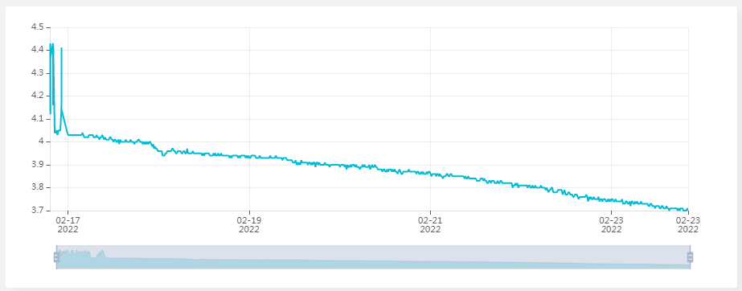

# RAK4631-Weather-Monitoring

## Power comsumption without Power Saving (Semaphore)

### Capacity of the Battery

- Battery Samsung INR18650-32E 3100mAh - 6.4A - 18650 - Li-ion

### Comsumption 

- 6.3 mA at rest  
- Peak at 72 mA when sending data over LoRaWan protocol
- The module drained the current of 4.03 Volts to 3.66 Volts in seven days
