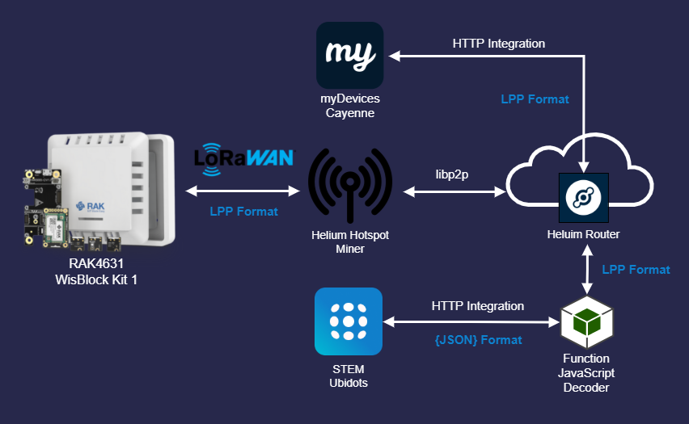
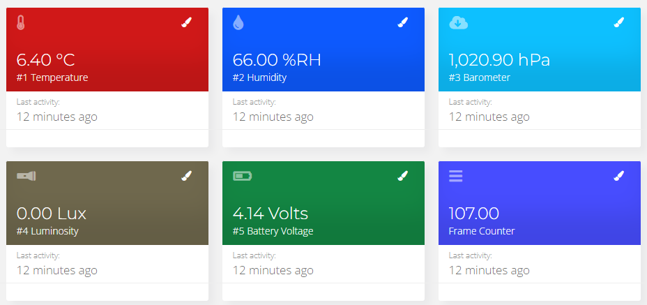
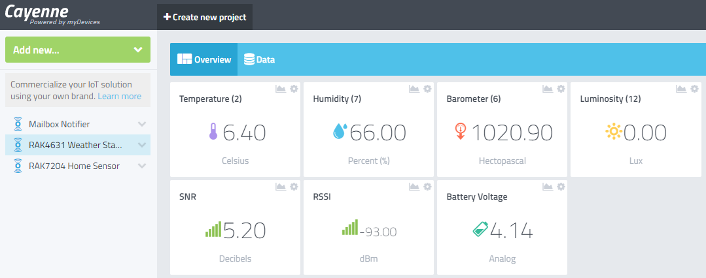
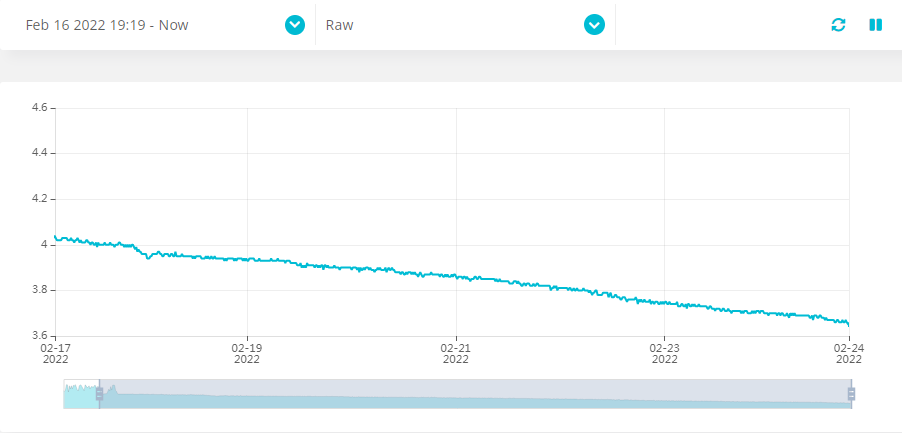

# RAK4631 Weather Monitoring - WisBlock Kit 1

- [RAK4631 Weather Monitoring - WisBlock Kit 1](#rak4631-weather-monitoring---wisblock-kit-1)
  - [Architecture](#architecture)
  - [Prerequisite RAK4631](#prerequisite-rak4631)
  - [Cayenne Low Power Payload Format](#cayenne-low-power-payload-format)
    - [Temperature](#temperature)
    - [Humidity](#humidity)
    - [Atmospheric Pressure](#atmospheric-pressure)
    - [Luminosity](#luminosity)
    - [Battery Voltage](#battery-voltage)
  - [Helium JavaScript Decoder Function](#helium-javascript-decoder-function)
  - [Ubidots](#ubidots)
  - [MyDevices Cayenne](#mydevices-cayenne)
  - [Power consumption without Power Saving (Semaphore)](#power-consumption-without-power-saving-semaphore)
    - [Battery Capacity](#battery-capacity)
    - [Power Consumption](#power-consumption)
  - [Power consumption with Power Saving mode](#power-consumption-with-power-saving-mode)
 

## Architecture



## Prerequisite RAK4631

Before to go further, I advice you to take note of the [official Helium RAK4631 documentation](https://docs.helium.com/use-the-network/devices/development/rakwireless/wisblock-4631/). You must follow carrefuly each steps to setup your [PlatformIO IDE](https://docs.helium.com/use-the-network/devices/development/rakwireless/wisblock-463/platformio/) environment.
My firmeware was outdated and I had some trouble with my USB driver. Thus, I have updated the bootloader with this [guide](https://forum.rakwireless.com/t/bootloader-fails-to-upgrade-via-ble/4193/3) and I have fixed some issues.              

The program has been widely inspired from the Wisblock [weather monitoring](https://github.com/RAKWireless/WisBlock/tree/master/examples/RAK4630/solutions/Weather_Monitoring) project from the official GitHub repository RAKWireless.

## Cayenne Low Power Payload Format

The payload has been adapted to be compatible with the LoRaWan [RAK7204](https://store.rakwireless.com/products/rak7204-lpwan-environmental-node) [Cayenne LPP](https://developers.mydevices.com/cayenne/docs/lora/#lora-cayenne-low-power-payload) payload and [RAK Unified Interface](https://github.com/RAKWireless/RUI_LoRa_node_payload_decoder).

The librarie [CayenneLPP.h](https://github.com/ElectronicCats/CayenneLPP) is used to build the data payload.

### Temperature

- Data Channel : **02**
- Data Type : **67**

``` C
lpp.addTemperature(2, temp);
```
### Humidity

- Data Channel : **07**
- Data Type : **68**

``` C
lpp.addRelativeHumidity(7, hum);
```

### Atmospheric Pressure

- Data Channel : **06**
- Data Type : **73**

``` C
lpp.addBarometricPressure(6, pres * 10);
```
### Luminosity

Only this data has been added on the channel 12 with the original RAK7204 payload.      

- Data Channel : **12**
- Data Type : **65**

``` C
lpp.addLuminosity(12, result.lux);
```
### Battery Voltage

- Data Channel : **8**
- Data Type : **02**

``` C
lpp.addAnalogInput(8, vbat / 1000);
```

## Helium JavaScript Decoder Function

The ubidots [JavaScript function decoder](https://gist.github.com/vhuynen/4147d0d65edb16d525ade26eb0dfb34a) from the Helium Console is shared with my **WisBlock Kit 1** and my **WisNode RAK7204**. Only the luminosity sensor decoding data has been added to be compatible.

Below the result of the decoding function expected by the ubidots API :

``` json
{
  "id": "3ef5a334-2901-498b-9683-6fc902e45542",
  "name": "Ubidots",
  "status": "success",
  "decoded_payload": {
    "barometer": {
      "context": {
        "uplink_fcnt": 156
      },
      "timestamp": 1646124272844,
      "value": 1020
    },
    "battery": {
      "context": {
        "uplink_fcnt": 156
      },
      "timestamp": 1646124272844,
      "value": 4.12
    },
    "humidity": {
      "context": {
        "uplink_fcnt": 156
      },
      "timestamp": 1646124272844,
      "value": 63
    },
    "lux": {
      "context": {
        "uplink_fcnt": 156
      },
      "timestamp": 1646124272844,
      "value": 262
    },
    "temperature": {
      "context": {
        "uplink_fcnt": 156
      },
      "timestamp": 1646124272844,
      "value": 9.6
    }
  }
}
```

## Ubidots

[Connect Helium with Ubidots](https://help.ubidots.com/en/articles/5008195-plugins-connect-helium-with-ubidots)



## MyDevices Cayenne

[Connect Helium with MyDevices Cayenne](https://docs.helium.com/use-the-network/console/integrations/mydevices-cayenne/)



## Power consumption without Power Saving (Semaphore)



### Battery Capacity

- Battery Samsung INR18650-32E 3100mAh - 6.4A - 18650 - Li-ion

### Power Consumption 

- 6.3 mA at rest  
- Peak at 72 mA when sending data over LoRaWan protocol
- The module drained the current of 4.03 Volts to 3.66 Volts in seven days

## Power consumption with Power Saving mode

Coming soon...