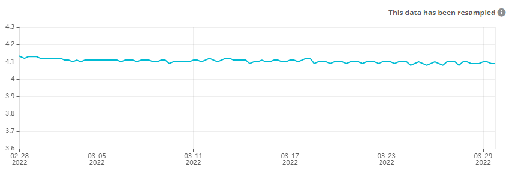

# RAK4631 Weather Monitoring - WisBlock Kit 1

WisBlock Kit 1 Weather Station is a project that use a RAK4631 LoRa module to transmit data (Temperature, Pressure, Luminosity and Humidity) over an Helium Gateway (RAK Miner V2) that relays data to an Helium router that dispatches the data to the platforms MyDevices Cayenne and Ubidots.

- [RAK4631 Weather Monitoring - WisBlock Kit 1](#rak4631-weather-monitoring---wisblock-kit-1)
  - [Architecture](#architecture)
  - [Prerequisite RAK4631](#prerequisite-rak4631)
  - [Cayenne Low Power Payload](#cayenne-low-power-payload)
    - [Temperature](#temperature)
    - [Humidity](#humidity)
    - [Atmospheric Pressure](#atmospheric-pressure)
    - [Luminosity](#luminosity)
    - [Battery Voltage](#battery-voltage)
  - [Helium Flows](#helium-flows)
  - [Helium JavaScript decoder function for Ubidots](#helium-javascript-decoder-function-for-ubidots)
  - [Ubidots](#ubidots)
    - [Ubidots Dashboard](#ubidots-dashboard)
  - [MyDevices Cayenne](#mydevices-cayenne)
  - [Power consumption](#power-consumption)
    - [Power consumption without deep sleep mode](#power-consumption-without-deep-sleep-mode)
    - [Power consumption with power saving mode](#power-consumption-with-power-saving-mode)
      - [Principal of the code](#principal-of-the-code)
    - [Battery Voltage](#battery-voltage-1)
 

## Architecture


## Prerequisite RAK4631

Before to go further, I advice you to take note of the [official Helium RAK4631 documentation](https://docs.helium.com/use-the-network/devices/development/rakwireless/wisblock-4631/). You must follow carrefuly each steps to setup your [PlatformIO IDE](https://docs.helium.com/use-the-network/devices/development/rakwireless/wisblock-463/platformio/) environment.
My firmeware was outdated and I had some trouble with my USB driver. Thus, I have updated the bootloader with this [guide](https://forum.rakwireless.com/t/bootloader-fails-to-upgrade-via-ble/4193/3) and I have fixed some issues.              

The program has been widely inspired from the Wisblock [weather monitoring](https://github.com/RAKWireless/WisBlock/tree/master/examples/RAK4630/solutions/Weather_Monitoring) project from the official GitHub repository RAKWireless.

## Cayenne Low Power Payload

The payload has been adapted to be compatible with the LoRaWan [RAK7204](https://store.rakwireless.com/products/rak7204-lpwan-environmental-node) [Cayenne LPP](https://developers.mydevices.com/cayenne/docs/lora/#lora-cayenne-low-power-payload) payload and [RAK Unified Interface](https://github.com/RAKWireless/RUI_LoRa_node_payload_decoder).

The librarie [CayenneLPP.h](https://github.com/ElectronicCats/CayenneLPP) is used to build the data payload.

### Temperature

- Data Channel : **02**
- Data Type : **67**

``` C
lpp.addTemperature(2, temp);
```
### Humidity

- Data Channel : **07**
- Data Type : **68**

``` C
lpp.addRelativeHumidity(7, hum);
```

### Atmospheric Pressure

- Data Channel : **06**
- Data Type : **73**

``` C
lpp.addBarometricPressure(6, pres * 10);
```
### Luminosity

Only this data has been added on the channel 12 with the original RAK7204 payload.      

- Data Channel : **12**
- Data Type : **65**

``` C
lpp.addLuminosity(12, result.lux);
```
### Battery Voltage

- Data Channel : **8**
- Data Type : **02**

``` C
lpp.addAnalogInput(8, vbat / 1000);
```

## Helium Flows

The data received from the device are in Cayenne LPP format and sended as is to MyDevices Cayenne. MyDevices expects an structured buffer so as to be loaded.

Regarding the Ubidots API, the expected format is JSON. This is performed by the JavaScript function that decodes the LPP buffer to JSON before to be sended to Ubidots.


## Helium JavaScript decoder function for Ubidots

The Ubidots [decoder function](https://gist.github.com/vhuynen/4147d0d65edb16d525ade26eb0dfb34a) from the Helium Console is shared with my **WisBlock Kit 1** and my **WisNode RAK7204**. Only the luminosity sensor decoding data has been added to be compatible.

Below the result of the JavaScript decoding function expected by the Ubidots API :

``` json
{
  "id": "3ef5a334-2901-498b-9683-6fc902e45542",
  "name": "Ubidots",
  "status": "success",
  "decoded_payload": {
    "barometer": {
      "context": {
        "uplink_fcnt": 156
      },
      "timestamp": 1646124272844,
      "value": 1020
    },
    "battery": {
      "context": {
        "uplink_fcnt": 156
      },
      "timestamp": 1646124272844,
      "value": 4.12
    },
    "humidity": {
      "context": {
        "uplink_fcnt": 156
      },
      "timestamp": 1646124272844,
      "value": 63
    },
    "lux": {
      "context": {
        "uplink_fcnt": 156
      },
      "timestamp": 1646124272844,
      "value": 262
    },
    "temperature": {
      "context": {
        "uplink_fcnt": 156
      },
      "timestamp": 1646124272844,
      "value": 9.6
    }
  }
}
```
## Ubidots

In order to send data from Helium to Ubidots, you should have to create a Helium Plugin. In my case, I have created the plugin from Helium console directly. Follow the section "creating the plugin from Helium" of [this article](https://help.Ubidots.com/en/articles/5008195-plugins-connect-helium-with-Ubidots) to achieve that.  

The data received from the RAK4631 will be decoded by the JavaScript Decoder function from Helium side. The Hexadecimal data received from the device will be decoded and transformed into a JSON payload that will be parsed and loaded by the Ubidots API.

The device is auto-provisioning by the Ubidots API when Ubidots received data from an unknown device. 

Below the result of the integration of data received from Helium to Ubidots : 


### Ubidots Dashboard

Below a dashboard with data from my Home Environmental Sensor RAK7204 and my Outdoor Weather Station WisBlock Kit 1.


## MyDevices Cayenne

As Ubidots, you should have to [connect](https://docs.helium.com/use-the-network/console/integrations/mydevices-cayenne/)
 Helium to your MyDevices Cayenne account.
 :warning: Unlike Ubiots platform, before to ingest data, you must adding yourself your device into MyDevices Cayenne.           

Below the result of the integration of LPP data received from Helium to MyDevices Cayenne : 


## Power consumption

Type of battery used : 
- Battery Samsung INR18650-32E 3100mAh - 6.4A - 18650 - Li-ion

###  Power consumption without deep sleep mode

After several days of data transmission every 15 minutes, I notice that the current drop very fast and that the module drained the current of 4.03 Volts to 3.66 Volts in least seven days.

Actually, the program don't take in account concerns of power consumption. I have analysed the power consumption and I observed that the module consumes 6.3 mA at rest with a peak of 72 mA when data are sending over the LoRaWan module.  

Below, the graph of current consumption on seven days :


### Power consumption with power saving mode

The tip to benefit the deep sleep mode with the Nordic nRF52840 is to use semaphores provide by the embedded operating system [FreeRTOS](https://www.freertos.org).

This topic has been very fine explain in the article of [how to reduce the Power Consumption of WisBlock Solution](https://news.rakwireless.com/how-to-reduce-the-power-consumption-of-wisblock-solutions/).

Below, the graph of current consumption on seven days with power saving mode, the curve is flat :rocket: :


#### Principal of the code

``` c
/** Semaphore used by events to wake up loop task */
SemaphoreHandle_t taskEvent = NULL;
/** Timer to wakeup task frequently and send message */
SoftwareTimer taskWakeupTimer;
// Timing between two sending data
long SLEEP_TIME = 900000;

void periodicWakeup(TimerHandle_t unused)
{
  // Give the semaphore, so the loop task will wake up
  xSemaphoreGiveFromISR(taskEvent, pdFALSE);
}

...

void setup() {

... // do other initialization before to take the semaphore

  // Create the loopTask semaphore
  taskEvent = xSemaphoreCreateBinary();
  // Initialize semaphore
  xSemaphoreGive(taskEvent);

  // Start the timer that will wakeup the loop frequently
  taskWakeupTimer.begin(SLEEP_TIME, periodicWakeup);
  taskWakeupTimer.start();

  // Take the semaphore so the loop will go to sleep until an event happens
  xSemaphoreTake(taskEvent, 10);

}

void loop()
{
  // Sleep until we are woken up by an event
  if (xSemaphoreTake(taskEvent, portMAX_DELAY) == pdTRUE)
  {
    // Send Data
    send_lora_frame();
    // Go back to sleep
    xSemaphoreTake(taskEvent, 10);
  }
}
```
### Battery Voltage

In order to follow the power consumption, the battery voltage is [read](https://github.com/RAKWireless/WisBlock/blob/master/examples/RAK4630/power/RAK4630_Battery_Level_Detect/Read_Battery_Level/Read_Battery_Level.ino) and sent at each cycle. 

Below the principal code that read the battery voltage :

``` c
// Battery Voltage
#define PIN_VBAT WB_A0
uint32_t vbat_pin = PIN_VBAT;
#define VBAT_MV_PER_LSB (0.73242188F) // 3.0V ADC range and 12 - bit ADC resolution = 3000mV / 4096
#define VBAT_DIVIDER_COMP (1.73)      // Compensation factor for the VBAT divider, depend on the board
#define REAL_VBAT_MV_PER_LSB (VBAT_DIVIDER_COMP * VBAT_MV_PER_LSB)

/**
 * @brief Get RAW Battery Voltage
 */
float readVBAT(void)
{
  float raw;

  // Get the raw 12-bit, 0..3000mV ADC value
  raw = analogRead(vbat_pin);

  return raw * REAL_VBAT_MV_PER_LSB;
}

void setup()
{
...
 // Initialize Battery Voltage

  // Set the analog reference to 3.0V (default = 3.6V)
  analogReference(AR_INTERNAL_3_0);

  // Set the resolution to 12-bit (0..4095)
  analogReadResolution(12); // Can be 8, 10, 12 or 14

  // Let the ADC settle
  delay(1);

  // Get a single ADC sample and throw it away
  readVBAT();

}
```